# Blockbuster Results Predictor Architecture Document

<!-- Powered by BMAD™ Core -->

## Introduction

This document outlines the overall project architecture for Blockbuster Results Predictor, including ML agents, data pipelines, model training/inference infrastructure, and integration with existing 127-agent ecosystem. Its primary goal is to serve as the guiding architectural blueprint for AI-driven development, ensuring consistency and adherence to chosen patterns and technologies.

**Relationship to Frontend Architecture:**
This is a backend ML system. No separate frontend architecture document is required. User interface is limited to Telegram alerts for traders.

### Starter Template or Existing Project

**Existing Project Foundation:** This project builds upon an existing VCP (Volatility Contraction Pattern) financial research platform with 127 production agents across two codebases:

1. **Primary Codebase:** `/Users/srijan/Desktop/aksh/agents/` - 46 agents including indian_pdf_extractor.py (80%+ PDF extraction), intelligent_earnings_collector.py (3-phase AI research), earnings_data_scraper.py
2. **Secondary Codebase:** `/Users/srijan/vcp/agents/` - 81 agents including vcp_detector.py, earnings_analyzer.py, blockbuster_detector.py (Vikram's 7-criteria), dexter/ multi-agent orchestrator

**Key Architectural Patterns from Existing System:**
- **Dexter Pattern:** Multi-agent orchestrator with 9 financial tools coordinating specialized sub-agents
- **Vikram Pattern:** 12 specialist sub-agents with task delegation registry
- **3-Phase Research:** Scraper (95% confidence) → Perplexity web search (75%) → AI inference (50-65%)
- **Agent Registry:** Centralized routing for query→specialist mapping

**Constraints Imposed by Existing System:**
- Must use SQLite databases (earnings_calendar.db, price_movements.db already exist)
- Must integrate with existing BSE Telegram bot (@BseAlertsTelegram_bot)
- Must reuse indian_pdf_extractor.py for PDF parsing (don't rewrite)
- Must follow Python 3.10+ and pytest testing conventions
- Must not break existing 127 agents (additive changes only)

**Rationale for Leveraging Existing System:**
Rewriting 127 agents would take 6+ months. By building 8 new ML agents that integrate with existing infrastructure, we achieve 80% code reuse and 6-8 week timeline.

### Change Log

| Date | Version | Description | Author |
|------|---------|-------------|--------|
| 2025-11-13 | 1.0.0 | Initial architecture using BMAD Method | VCP Financial Research Team |

## High Level Architecture

### Technical Summary

The Blockbuster Results Predictor uses a **modular monolith with multi-agent architecture**, where 8 new ML-specific agents orchestrate historical data collection, feature engineering, model training, real-time inference, and continuous monitoring. The system integrates with 127 existing financial research agents via a master orchestrator pattern, leveraging production-grade PDF extraction, earnings scraping, and VCP detection capabilities. Machine learning models (XGBoost, LightGBM, Random Forest) predict upper circuit probability (0-100%) based on 25-30 features extracted per company-quarter, achieving F1 ≥0.70 with <2 minute real-time latency. The architecture emphasizes TDD, feature drift detection, and automated retraining to maintain ≥70% precision over time. Data flows through 5 SQLite databases for historical training, feature storage, and production monitoring, with MLflow tracking experiments and model versions.

### High Level Overview

**Architectural Style:** Modular Monolith with Agent Architecture
- Single Python codebase at `/Users/srijan/Desktop/aksh/` containing all agents
- Each agent is an independent Python module with clear responsibilities
- Agents communicate via direct Python imports and SQLite databases (no microservices overhead)
- Horizontal scaling: spin up multiple MLInferenceAgent processes for high throughput

**Repository Structure:** Monorepo (as specified in PRD)
- Existing structure: `/Users/srijan/Desktop/aksh/agents/` contains 46 agents
- New ML agents added to same directory: ml_data_collector.py, ml_feature_engineer.py, ml_training_agent.py, etc.
- Shared utilities in `/Users/srijan/Desktop/aksh/utils/`
- Tests in `/Users/srijan/Desktop/aksh/tests/` mirroring agent structure

**Service Architecture:** Multi-Agent Coordination
- **MLMasterOrchestrator** dispatches tasks to 7 specialist agents
- Agents run as Python processes (not services), communicate via function calls
- For real-time inference: MLInferenceAgent runs as long-lived daemon listening to Telegram
- For batch jobs (data collection, training): agents run as scheduled cron jobs

**Primary User Interaction Flow:**
1. BSE announces earnings → Telegram bot forwards alert (3 seconds)
2. MLInferenceAgent receives alert → downloads PDF → extracts features → predicts (120 seconds)
3. If probability ≥70% → Send Telegram alert to traders

**Primary Data Flow:**
1. **Historical (offline):** BSE PDFs → indian_pdf_extractor → historical_financials.db → MLFeatureEngineerAgent → feature_store.db → MLTrainingAgent → trained_model.pkl
2. **Real-time (online):** BSE Telegram → PDF URL → MLFeatureEngineerAgent (reuses logic) → MLInferenceAgent → Prediction → Telegram alert

**Key Architectural Decisions:**
1. **SQLite over PostgreSQL:** Development on single machine, <20GB data, avoid deployment complexity
2. **Monorepo over Polyrepo:** 8 new agents share code with 127 existing agents, monorepo simplifies imports
3. **Modular Monolith over Microservices:** <100 daily earnings (low scale), microservices overhead (orchestration, networking) unnecessary
4. **SHAP over LIME:** Tree model explainability standard, faster computation, better for feature importance

### High Level Project Diagram


### Architectural and Design Patterns

**1. Multi-Agent Orchestration Pattern**
- **Pattern:** Master-worker pattern where MLMasterOrchestrator coordinates 7 specialist agents
- **Rationale:** Aligns with existing Dexter/Vikram 127-agent ecosystem, enables independent testing and horizontal scaling of agents
- **Implementation:** Each agent is a Python class with clear interface (e.g., `collect_data()`, `engineer_features()`, `train_model()`), orchestrator calls agents sequentially for batch jobs, asynchronously for real-time

**2. Feature Store Pattern**
- **Pattern:** Centralized feature_store.db caching engineered features to avoid recomputation
- **Rationale:** Feature engineering is expensive (30s per sample), storing 200K pre-computed features enables fast training (load from DB vs recompute), ensures train-serve consistency
- **Implementation:** feature_store.db table with (sample_id, bse_code, earnings_date, label, feature_1..feature_27, feature_version), indexed on (bse_code, earnings_date)

**3. Model Registry Pattern**
- **Pattern:** Versioned model artifacts in `/models/` with MLflow experiment tracking
- **Rationale:** Enable A/B testing, rollback to previous version if new model underperforms, audit trail for compliance
- **Implementation:** Save models as `{algorithm}_v{version}.pkl` (e.g., xgboost_v1.0.0.pkl), MLflow tracks hyperparameters/metrics, champion model symlinked for inference

**4. CQRS (Command Query Responsibility Segregation) Pattern**
- **Pattern:** Separate pipelines for training (write/command) and inference (read/query)
- **Rationale:** Training is batch, slow (4 hours for 200K samples), inference is real-time, fast (<2 min), different performance characteristics
- **Implementation:** MLTrainingAgent writes to feature_store.db and models/, MLInferenceAgent reads from models/ and feature_store.db (read-only)

**5. Circuit Breaker Pattern**
- **Pattern:** Inference pipeline pauses if 10 consecutive predictions fail
- **Rationale:** Prevent cascading failures (e.g., if feature extraction breaks, don't spam errors), alert admin for manual intervention
- **Implementation:** MLInferenceAgent tracks failure count, if ≥10 → pause for 5 min, send admin alert, resume after cooldown

**6. Observer Pattern for Monitoring**
- **Pattern:** MLMonitoringAgent observes predictions, tracks actuals, triggers retraining
- **Rationale:** Decouple inference (prediction) from monitoring (accuracy tracking), enable continuous learning without modifying inference agent
- **Implementation:** MLInferenceAgent logs predictions to ml_monitoring.db, MLMonitoringAgent reads daily, computes metrics, alerts if drift detected

## Tech Stack

This is the DEFINITIVE technology selection section. All technologies have been selected based on:
- Existing VCP project dependencies (Python 3.10+, SQLite, pytest)
- ML best practices (XGBoost for tabular data, SHAP for explainability)
- No-cloud constraint (<4GB RAM, <2 CPU cores, single machine)
- TDD requirement (pytest, high coverage)

### Cloud Infrastructure

- **Provider:** None (on-premise single machine development)
- **Key Services:** N/A
- **Deployment Regions:** N/A

**Rationale:** PRD specifies "No Cloud Budget" and development on single machine. Future production deployment may use AWS EC2 t3.medium or similar.

### Technology Stack Table

| Category | Technology | Version | Purpose | Rationale |
|----------|------------|---------|---------|-----------|
| **Language** | Python | 3.10+ | Primary development language | Existing codebase standard, ML ecosystem (scikit-learn, pandas, XGBoost), strong typing with type hints |
| **Runtime** | CPython | 3.10.12 | Python interpreter | Official Python runtime, stable performance |
| **ML Framework** | XGBoost | 2.0.3 | Primary classifier algorithm | State-of-the-art for tabular data, handles class imbalance well, fast inference |
| **ML Framework** | LightGBM | 4.1.0 | Secondary classifier algorithm | Faster training than XGBoost, lower memory, comparable accuracy |
| **ML Framework** | scikit-learn | 1.4.0 | Baseline Random Forest, preprocessing | Industry standard, extensive utilities (SMOTE, scalers, metrics) |
| **Hyperparameter Tuning** | Optuna | 3.5.0 | Automated hyperparameter optimization | More efficient than GridSearch, Bayesian optimization, 100 trials target |
| **Explainability** | SHAP | 0.44.0 | Model interpretability | Tree explainer for XGBoost/LightGBM, fast, accurate feature importance |
| **Experiment Tracking** | MLflow | 2.10.0 | Model versioning and tracking | Open-source, tracks hyperparameters/metrics/artifacts, local deployment |
| **Class Imbalance** | imbalanced-learn | 0.11.0 | SMOTE oversampling | Handles 5-10% positive class, integrates with scikit-learn |
| **Data Manipulation** | pandas | 2.1.4 | DataFrame operations | Feature engineering, data cleaning, CSV/SQLite I/O |
| **Numerical Computing** | NumPy | 1.26.3 | Array operations | Underlies pandas/scikit-learn, fast vectorized ops |
| **Database** | SQLite | 3.40.0 (bundled) | 5 databases for historical and prod data | Serverless, <20GB data fits easily, no deployment overhead |
| **Price Data API** | yfinance | 0.2.35 | Historical NSE price/volume data | Free, no API key, covers NSE symbols (TICKER.NS format) |
| **Telegram Bot** | python-telegram-bot | 20.7 | Telegram alerts integration | Official library, async support, existing bot integration |
| **PDF Extraction** | PyPDF2 | 3.0.1 | PDF text extraction (via indian_pdf_extractor.py) | Lightweight, pure Python, 80%+ success on BSE PDFs |
| **NLP Sentiment** | transformers (FinBERT) | 4.37.0 | Management commentary sentiment | FinBERT fine-tuned on financial text, 0-1 sentiment score |
| **Testing Framework** | pytest | 8.0.0 | Unit/integration/E2E tests | Existing standard, fixtures, parametrized tests, coverage plugin |
| **Coverage** | pytest-cov | 4.1.0 | Test coverage reporting | Integrates with pytest, enforces ≥80% coverage |
| **Linting** | ruff | 0.1.14 | Fast Python linter | Replaces flake8+black+isort, 10-100x faster |
| **Type Checking** | mypy | 1.8.0 | Static type checking | Enforce type hints, catch bugs pre-runtime |
| **CI/CD** | GitHub Actions | N/A | Automated testing and deployment | Free for public repos, YAML config, pytest integration |
| **Logging** | Python logging | stdlib | Structured logging | Built-in, JSON formatter for easy parsing |
| **Environment Management** | python-dotenv | 1.0.0 | .env file loading | Secrets management (API keys, bot tokens) |
| **HTTP Requests** | requests | 2.31.0 | BSE PDF download, BhavCopy fetch | De facto standard, robust error handling |
| **Fuzzy Matching** | fuzzywuzzy | 0.18.0 | BSE-NSE company name matching | Levenshtein distance, ≥90% threshold for mapping |

## Data Models

### UpperCircuitLabel (historical_upper_circuits.db)

**Purpose:** Store labeled training data identifying which earnings announcements led to upper circuit movements

**Key Attributes:**
- `sample_id`: INTEGER PRIMARY KEY AUTOINCREMENT - Unique sample identifier
- `bse_code`: TEXT NOT NULL - BSE company code (6 digits, e.g., "500325")
- `nse_symbol`: TEXT - NSE symbol (e.g., "RELIANCE", may be NULL if unmapped)
- `earnings_date`: DATE NOT NULL - Earnings announcement date (YYYY-MM-DD)
- `next_day_date`: DATE NOT NULL - Trading day after announcement
- `price_change_pct`: REAL - Percentage price change next day (e.g., 7.5 for 7.5% gain)
- `hit_circuit`: BOOLEAN - Whether upper circuit limit was hit (1=yes, 0=no)
- `label`: BOOLEAN NOT NULL - Training label (1=upper circuit, 0=no circuit)
- `created_at`: TIMESTAMP DEFAULT CURRENT_TIMESTAMP

**Relationships:**
- One-to-one with HistoricalFinancials on (bse_code, earnings_date)
- One-to-one with FeatureVector on (bse_code, earnings_date)

**Indexes:**
- `idx_bse_earnings` on (bse_code, earnings_date) for fast lookups
- `idx_label` on (label) for class balance queries

### HistoricalFinancials (historical_financials.db)

**Purpose:** Store extracted quarterly financial data (Revenue, PAT, EPS, Margins) for fundamental feature engineering

**Key Attributes:**
- `financial_id`: INTEGER PRIMARY KEY AUTOINCREMENT
- `bse_code`: TEXT NOT NULL
- `quarter`: TEXT NOT NULL - "Q1"|"Q2"|"Q3"|"Q4"
- `year`: INTEGER NOT NULL - Fiscal year (e.g., 2025 for FY25)
- `revenue_cr`: REAL - Revenue in Crores (e.g., 1234.56)
- `pat_cr`: REAL - Profit After Tax in Crores (can be negative)
- `eps`: REAL - Earnings Per Share (₹)
- `opm`: REAL - Operating Profit Margin (%)
- `npm`: REAL - Net Profit Margin (%)
- `extraction_date`: DATE - When PDF was extracted
- `extraction_confidence`: REAL - Confidence score 0-1 from indian_pdf_extractor.py

**Relationships:**
- Many HistoricalFinancials to one Company (bse_code)
- Used by MLFeatureEngineerAgent to calculate QoQ/YoY growth

**Indexes:**
- `idx_bse_quarter_year` on (bse_code, quarter, year) UNIQUE
- `idx_year_quarter` on (year, quarter) for time-series queries

### PriceMovement (price_movements.db)

**Purpose:** Store daily OHLCV data and circuit information for technical feature engineering

**Key Attributes:**
- `price_id`: INTEGER PRIMARY KEY AUTOINCREMENT
- `bse_code`: TEXT NOT NULL
- `nse_symbol`: TEXT - Mapped NSE symbol
- `date`: DATE NOT NULL
- `open`: REAL NOT NULL
- `high`: REAL NOT NULL
- `low`: REAL NOT NULL
- `close`: REAL NOT NULL
- `volume`: INTEGER NOT NULL
- `prev_close`: REAL - Previous day close for % change calculation
- `circuit_limit`: REAL - Upper circuit limit price
- `hit_upper_circuit`: BOOLEAN - Whether stock hit upper circuit this day
- `hit_lower_circuit`: BOOLEAN
- `source`: TEXT - "bhav_copy"|"yfinance" for data lineage

**Relationships:**
- Many PriceMovements to one Company (bse_code/nse_symbol)
- Used for RSI, volume spike, previous circuits, price momentum features

**Indexes:**
- `idx_bse_date` on (bse_code, date) for time-series queries
- `idx_nse_date` on (nse_symbol, date) for yfinance lookups
- `idx_date` on (date) for market-wide aggregations

### FeatureVector (feature_store.db)

**Purpose:** Centralized storage of engineered features for training and inference, avoiding recomputation

**Key Attributes:**
- `sample_id`: INTEGER PRIMARY KEY AUTOINCREMENT
- `bse_code`: TEXT NOT NULL
- `nse_symbol`: TEXT
- `earnings_date`: DATE NOT NULL
- `label`: BOOLEAN NOT NULL - Training label from UpperCircuitLabel
- `revenue_qoq_pct`: REAL - Feature 1: Revenue QoQ growth %
- `pat_qoq_pct`: REAL - Feature 2: PAT QoQ growth %
- `eps_qoq_pct`: REAL - Feature 3: EPS QoQ growth %
- `opm`: REAL - Feature 4: Operating Profit Margin
- `npm`: REAL - Feature 5: Net Profit Margin
- `debt_to_equity`: REAL - Feature 6: Debt-to-equity ratio
- `revenue_yoy_pct`: REAL - Feature 7: Revenue YoY growth %
- `pat_yoy_pct`: REAL - Feature 8: PAT YoY growth %
- `rsi_14d`: REAL - Feature 9: RSI 14-day
- `volume_spike_ratio`: REAL - Feature 10: Volume / 30-day avg
- `prev_circuits_6m`: INTEGER - Feature 11: Upper circuits in last 6 months
- `price_change_1w_pct`: REAL - Feature 12: Price change 1 week before
- `market_cap_log`: REAL - Feature 13: log10(market cap in Cr)
- `distance_from_ma50_pct`: REAL - Feature 14: Distance from 50-day MA
- *(... features 15-27 similarly named ...)*
- `created_at`: TIMESTAMP DEFAULT CURRENT_TIMESTAMP
- `feature_version`: TEXT - "v1.0.0" for A/B testing feature changes

**Relationships:**
- One-to-one with UpperCircuitLabel on (bse_code, earnings_date)

**Indexes:**
- `idx_bse_earnings_fv` on (bse_code, earnings_date) UNIQUE
- `idx_label_fv` on (label) for train/test split
- `idx_feature_version` on (feature_version) for experiment comparison

### MLMonitoring (ml_monitoring.db)

**Purpose:** Track production predictions, actual outcomes, and performance metrics for continuous learning

**Key Attributes:**
- `prediction_id`: INTEGER PRIMARY KEY AUTOINCREMENT
- `bse_code`: TEXT NOT NULL
- `prediction_date`: DATE NOT NULL - When prediction was made
- `predicted_prob`: REAL NOT NULL - Upper circuit probability 0-100%
- `confidence_level`: TEXT - "Very High"|"High"|"Medium"|"Low"
- `top_5_features`: TEXT - JSON array of top 5 SHAP features
- `actual_circuit`: BOOLEAN - Actual outcome (NULL until next day)
- `price_change_1d`: REAL - Actual price change 1 day after
- `price_change_3d`: REAL - Actual price change 3 days after
- `price_change_7d`: REAL - Actual price change 7 days after
- `alert_sent`: BOOLEAN - Whether Telegram alert was sent
- `model_version`: TEXT - "v1.0.0" which model generated prediction
- `latency_ms`: INTEGER - End-to-end latency in milliseconds
- `created_at`: TIMESTAMP DEFAULT CURRENT_TIMESTAMP
- `updated_at`: TIMESTAMP - When actual outcomes were recorded

**Relationships:**
- Many MLMonitoring records per model_version
- Used by MLMonitoringAgent for weekly metrics calculation

**Indexes:**
- `idx_prediction_date` on (prediction_date) for time-series analysis
- `idx_model_version` on (model_version) for version comparison
- `idx_actual_recorded` on (actual_circuit) WHERE actual_circuit IS NOT NULL

## Components

### MLMasterOrchestrator

**Responsibility:** Coordinate all ML agents for batch jobs (data collection, training) and real-time inference

**Key Interfaces:**
- `orchestrate_data_collection(start_date: str, end_date: str) -> CollectionReport`
- `orchestrate_training(algorithm: str = "auto") -> TrainedModel`
- `orchestrate_realtime_inference()` (long-running daemon)
- `trigger_retraining(reason: str)` (called by MLMonitoringAgent)

**Dependencies:**
- MLDataCollectorAgent (for historical data collection)
- MLFeatureEngineerAgent (for feature extraction)
- MLTrainingAgent (for model training)
- MLInferenceAgent (for real-time predictions)
- MLMonitoringAgent (for accuracy tracking)
- MLBacktestingAgent (for pre-deployment validation)

**Technology Stack:**
- Python 3.10+ asyncio for concurrent task execution
- SQLite for coordination state (track which tasks completed)
- Python logging for structured logs

### MLDataCollectorAgent

**Responsibility:** Collect 2-3 years of historical data (earnings, financials, prices, labels) for ~11,000 NSE/BSE companies

**Key Interfaces:**
- `collect_all_data(start_date: str, end_date: str) -> CollectionReport`
- `label_upper_circuits(bse_codes: List[str]) -> int` (returns num samples labeled)
- `improve_bse_nse_mapping() -> MappingReport` (improve from 33.9% to ≥80%)
- `extract_historical_financials(bse_codes: List[str]) -> int` (returns num extracted)
- `collect_price_data(bse_codes: List[str]) -> int`

**Dependencies:**
- indian_pdf_extractor.py (existing, for PDF parsing)
- yfinance (for price data fallback)
- requests (for BhavCopy CSV download)
- fuzzywuzzy (for BSE-NSE name matching)

**Technology Stack:** Python, pandas, SQLite, requests, PyPDF2 (via indian_pdf_extractor.py)

### MLFeatureEngineerAgent

**Responsibility:** Extract 25-30 features per company-quarter, integrating with 127 existing agents

**Key Interfaces:**
- `engineer_features(bse_code: str, earnings_date: str) -> Optional[FeatureVector]`
- `engineer_batch_features(samples: List[Tuple[str, str]]) -> List[FeatureVector]` (batch for training)
- `get_training_data(test_size: float = 0.15) -> Tuple[X_train, y_train, X_test, y_test]`

**Dependencies:**
- historical_financials.db (for fundamental features)
- price_movements.db (for technical features)
- vcp_detector.py (existing, for VCP features)
- earnings_analyzer.py (existing, for earnings quality)
- transformers (FinBERT for sentiment)
- scikit-learn (RobustScaler, MinMaxScaler for normalization)

**Technology Stack:** Python, pandas, NumPy, scikit-learn, transformers

### MLTrainingAgent

**Responsibility:** Train XGBoost/LightGBM/Random Forest models with hyperparameter tuning, handle class imbalance

**Key Interfaces:**
- `train_xgboost(X_train, y_train, X_val, y_val) -> XGBClassifier`
- `train_lightgbm(X_train, y_train, X_val, y_val) -> LGBMClassifier`
- `train_random_forest(X_train, y_train, X_val, y_val) -> RandomForestClassifier`
- `select_champion_model(models: List[TrainedModel]) -> ChampionModel`
- `compute_shap_values(model, X_test) -> SHAPExplainer`

**Dependencies:**
- XGBoost, LightGBM, scikit-learn (algorithms)
- imbalanced-learn (SMOTE for class imbalance)
- Optuna (hyperparameter tuning)
- SHAP (explainability)
- MLflow (experiment tracking)

**Technology Stack:** Python, XGBoost 2.0.3, LightGBM 4.1.0, scikit-learn, Optuna, SHAP, MLflow

### MLInferenceAgent

**Responsibility:** Real-time predictions on new earnings with <2 min latency, SHAP explanations

**Key Interfaces:**
- `predict(bse_code: str, earnings_date: str, pdf_path: str) -> PredictionResult`
- `listen_to_telegram_bot()` (daemon, listens for BSE alerts)
- `load_champion_model() -> Tuple[Model, SHAPExplainer]`

**Dependencies:**
- champion_model_v1.0.0.pkl (trained model)
- shap_explainer.pkl (SHAP explainer object)
- MLFeatureEngineerAgent (for feature extraction)
- MLAlertAgent (for sending Telegram alerts)
- python-telegram-bot (for receiving BSE alerts)

**Technology Stack:** Python asyncio, XGBoost/LightGBM, SHAP, python-telegram-bot

### MLMonitoringAgent

**Responsibility:** Track prediction accuracy over time, detect feature drift, trigger retraining

**Key Interfaces:**
- `record_actual_outcome(bse_code: str, prediction_date: str)` (fetch actual price movement)
- `calculate_weekly_metrics() -> MetricsReport`
- `detect_feature_drift() -> DriftReport`
- `should_trigger_retraining() -> Tuple[bool, str]` (returns reason if yes)

**Dependencies:**
- ml_monitoring.db (predictions and actuals)
- yfinance (for actual price movements)
- scipy (Kolmogorov-Smirnov test for drift detection)
- MLMasterOrchestrator (to trigger retraining)

**Technology Stack:** Python, pandas, scipy, yfinance

### MLBacktestingAgent

**Responsibility:** Validate models on Q4 FY25 historical data before deployment

**Key Interfaces:**
- `backtest_model(model_path: str, test_period_start: str, test_period_end: str) -> BacktestReport`
- `generate_confusion_matrix(y_true, y_pred) -> pd.DataFrame`
- `calculate_roi(predictions: List[PredictionResult]) -> float` (if traded on signals)

**Dependencies:**
- feature_store.db (Q4 FY25 historical features)
- champion_model.pkl (model to backtest)
- scikit-learn (metrics: precision, recall, F1, confusion matrix)

**Technology Stack:** Python, pandas, scikit-learn, matplotlib (for confusion matrix viz)

### MLAlertAgent

**Responsibility:** Send formatted Telegram alerts for high-confidence predictions (≥70%)

**Key Interfaces:**
- `send_alert(prediction: PredictionResult, company_name: str)`
- `format_alert_message(prediction: PredictionResult) -> str`

**Dependencies:**
- python-telegram-bot (Telegram Bot API)
- Telegram bot token from `.env`

**Technology Stack:** Python, python-telegram-bot 20.7

### Component Diagrams


## Core Workflows

### Workflow 1: Historical Data Collection (One-Time Setup)


### Workflow 2: Feature Engineering & Model Training


### Workflow 3: Real-Time Inference (Telegram Alert → Prediction → Alert)

```mermaid
sequenceDiagram
    participant BSE as BSE Telegram Bot
    participant INFERENCE as MLInferenceAgent
    participant PDF_EXT as indian_pdf_extractor
    participant FEATURE as MLFeatureEngineerAgent
    participant MODEL as champion_model.pkl
    participant SHAP as shap_explainer.pkl
    participant ALERT as MLAlertAgent
    participant TRADER as Trader (Telegram)
    participant DB5 as ml_monitoring.db

    BSE->>INFERENCE: Telegram message: "Company: MEDINOVA, BSE: 526301, PDF: https://..."
    Note over INFERENCE: t=0s

    INFERENCE->>INFERENCE: Parse: {bse_code: "526301", pdf_url: "...", date: "2025-11-13"}
    INFERENCE->>PDF_EXT: Download PDF (30s timeout)
    PDF_EXT-->>INFERENCE: /tmp/earnings_pdfs/526301_2025-11-13.pdf
    Note over INFERENCE: t=5s

    INFERENCE->>FEATURE: engineer_features("526301", "2025-11-13")
    FEATURE->>FEATURE: Extract fundamental (Revenue QoQ, PAT QoQ, etc.)
    FEATURE->>FEATURE: Calculate technical (RSI, volume spike, etc.)
    FEATURE->>FEATURE: Extract qualitative (sentiment, orders, etc.)
    FEATURE-->>INFERENCE: feature_vector (27 features)
    Note over INFERENCE: t=35s

    INFERENCE->>MODEL: model.predict_proba(feature_vector)
    MODEL-->>INFERENCE: [0.23, 0.77] (77% upper circuit probability)
    Note over INFERENCE: t=40s

    INFERENCE->>SHAP: explainer.shap_values(feature_vector)
    SHAP-->>INFERENCE: shap_values array
    INFERENCE->>INFERENCE: Rank features by |SHAP|, select top 5
    Note over INFERENCE: t=45s

    alt Probability ≥70%
        INFERENCE->>ALERT: send_alert(PredictionResult)
        ALERT->>TRADER: 🚀 UPPER CIRCUIT ALERT<br/>MEDINOVA (77%)<br/>1️⃣ PAT QoQ +63.7% (+0.18)<br/>2️⃣ Volume Spike 2.1x (+0.15)...
        Note over INFERENCE: t=50s
    end

    INFERENCE->>DB5: Log prediction (bse_code, prob, features, latency_ms: 50000)
    Note over INFERENCE: Total latency: 50s (< 2 min target ✓)
```



### Workflow 4: Monitoring & Drift Detection → Retraining

```mermaid
sequenceDiagram
    participant SCHEDULER as Cron Scheduler
    participant MONITOR as MLMonitoringAgent
    participant YFINANCE as yfinance API
    participant DB5 as ml_monitoring.db
    participant DRIFT as Feature Drift Detector
    participant ORCH as MLMasterOrchestrator
    participant TRAINER as MLTrainingAgent

    SCHEDULER->>MONITOR: Daily 9:00 PM IST

    MONITOR->>DB5: Query predictions WHERE actual_circuit IS NULL AND prediction_date < NOW()-1d
    DB5-->>MONITOR: List of predictions needing actuals

    loop For each prediction
        MONITOR->>YFINANCE: Get price data (prediction_date, prediction_date+7d)
        YFINANCE-->>MONITOR: OHLCV data
        MONITOR->>MONITOR: Calculate price_change_1d, 3d, 7d
        MONITOR->>MONITOR: Determine actual_circuit (price_change_1d ≥5%)
        MONITOR->>DB5: UPDATE actual_circuit, price_change_*
    end

    MONITOR->>MONITOR: calculate_weekly_metrics()
    MONITOR->>DB5: Query last 7 days predictions with actuals
    MONITOR->>MONITOR: Compute TP, FP, TN, FN → Precision, Recall, F1

    alt Precision drops ≥5% from baseline
        MONITOR->>ORCH: trigger_retraining(reason="Precision dropped from 75% to 69%")
    else F1 still acceptable
        MONITOR->>DRIFT: detect_feature_drift()
        DRIFT->>DB5: Load training feature stats vs last 30 days
        loop For 27 features
            DRIFT->>DRIFT: Kolmogorov-Smirnov test (p-value < 0.05?)
        end
        DRIFT-->>MONITOR: drift_score=35% (9/27 features drifted)

        alt drift_score > 30%
            MONITOR->>ORCH: trigger_retraining(reason="Feature drift 35%")
        end
    end

    alt Retraining triggered
        ORCH->>TRAINER: Collect last 18 months data + new 3 months
        ORCH->>TRAINER: Retrain champion model algorithm
        TRAINER->>TRAINER: Train, evaluate, save if F1 improved ≥2%
        TRAINER-->>ORCH: New model v1.1.0 (F1: 0.74, old: 0.72)
        ORCH->>ORCH: Deploy new model, send admin notification
    end
```



## Database Schema

### historical_upper_circuits.db

```sql
CREATE TABLE upper_circuit_labels (
    sample_id INTEGER PRIMARY KEY AUTOINCREMENT,
    bse_code TEXT NOT NULL,
    nse_symbol TEXT,
    earnings_date DATE NOT NULL,
    next_day_date DATE NOT NULL,
    price_change_pct REAL,
    hit_circuit BOOLEAN,
    label BOOLEAN NOT NULL,
    created_at TIMESTAMP DEFAULT CURRENT_TIMESTAMP
);

CREATE INDEX idx_bse_earnings ON upper_circuit_labels(bse_code, earnings_date);
CREATE INDEX idx_label ON upper_circuit_labels(label);
```

### historical_financials.db

```sql
CREATE TABLE historical_financials (
    financial_id INTEGER PRIMARY KEY AUTOINCREMENT,
    bse_code TEXT NOT NULL,
    quarter TEXT NOT NULL CHECK(quarter IN ('Q1', 'Q2', 'Q3', 'Q4')),
    year INTEGER NOT NULL,
    revenue_cr REAL,
    pat_cr REAL,
    eps REAL,
    opm REAL,
    npm REAL,
    extraction_date DATE,
    extraction_confidence REAL,
    UNIQUE(bse_code, quarter, year)
);

CREATE INDEX idx_bse_quarter_year ON historical_financials(bse_code, quarter, year);
CREATE INDEX idx_year_quarter ON historical_financials(year, quarter);
```

### price_movements.db

```sql
CREATE TABLE price_movements (
    price_id INTEGER PRIMARY KEY AUTOINCREMENT,
    bse_code TEXT NOT NULL,
    nse_symbol TEXT,
    date DATE NOT NULL,
    open REAL NOT NULL,
    high REAL NOT NULL,
    low REAL NOT NULL,
    close REAL NOT NULL,
    volume INTEGER NOT NULL,
    prev_close REAL,
    circuit_limit REAL,
    hit_upper_circuit BOOLEAN,
    hit_lower_circuit BOOLEAN,
    source TEXT CHECK(source IN ('bhav_copy', 'yfinance')),
    UNIQUE(bse_code, date)
);

CREATE INDEX idx_bse_date ON price_movements(bse_code, date);
CREATE INDEX idx_nse_date ON price_movements(nse_symbol, date);
CREATE INDEX idx_date ON price_movements(date);
```

### feature_store.db

```sql
CREATE TABLE feature_store (
    sample_id INTEGER PRIMARY KEY AUTOINCREMENT,
    bse_code TEXT NOT NULL,
    nse_symbol TEXT,
    earnings_date DATE NOT NULL,
    label BOOLEAN NOT NULL,
    -- Fundamental features (8)
    revenue_qoq_pct REAL,
    pat_qoq_pct REAL,
    eps_qoq_pct REAL,
    opm REAL,
    npm REAL,
    debt_to_equity REAL,
    revenue_yoy_pct REAL,
    pat_yoy_pct REAL,
    -- Technical features (6)
    rsi_14d REAL,
    volume_spike_ratio REAL,
    prev_circuits_6m INTEGER,
    price_change_1w_pct REAL,
    market_cap_log REAL,
    distance_from_ma50_pct REAL,
    -- Qualitative features (4)
    new_orders_mentioned BOOLEAN,
    guidance_tone REAL,
    sentiment_score REAL,
    exceptional_items BOOLEAN,
    -- Seasonality features (3)
    hist_q1_avg_pct REAL,
    hist_q2_avg_pct REAL,
    hist_q3_avg_pct REAL,
    -- VCP features (3)
    vcp_detected BOOLEAN,
    vcp_stage INTEGER,
    vcp_contraction_depth_pct REAL,
    -- Market context features (3)
    nifty_change_pct REAL,
    sector_change_pct REAL,
    market_breadth_ratio REAL,
    created_at TIMESTAMP DEFAULT CURRENT_TIMESTAMP,
    feature_version TEXT DEFAULT 'v1.0.0',
    UNIQUE(bse_code, earnings_date, feature_version)
);

CREATE INDEX idx_bse_earnings_fv ON feature_store(bse_code, earnings_date);
CREATE INDEX idx_label_fv ON feature_store(label);
CREATE INDEX idx_feature_version ON feature_store(feature_version);
```

### ml_monitoring.db

```sql
CREATE TABLE ml_monitoring (
    prediction_id INTEGER PRIMARY KEY AUTOINCREMENT,
    bse_code TEXT NOT NULL,
    prediction_date DATE NOT NULL,
    predicted_prob REAL NOT NULL,
    confidence_level TEXT CHECK(confidence_level IN ('Very High', 'High', 'Medium', 'Low')),
    top_5_features TEXT, -- JSON array
    actual_circuit BOOLEAN,
    price_change_1d REAL,
    price_change_3d REAL,
    price_change_7d REAL,
    alert_sent BOOLEAN,
    model_version TEXT,
    latency_ms INTEGER,
    created_at TIMESTAMP DEFAULT CURRENT_TIMESTAMP,
    updated_at TIMESTAMP
);

CREATE INDEX idx_prediction_date ON ml_monitoring(prediction_date);
CREATE INDEX idx_model_version ON ml_monitoring(model_version);
CREATE INDEX idx_actual_recorded ON ml_monitoring(actual_circuit) WHERE actual_circuit IS NOT NULL;
```

## Source Tree

```
/Users/srijan/Desktop/aksh/
├── agents/                             # All agents (existing 46 + new 8 ML agents)
│   ├── ml_data_collector.py          # NEW: Historical data collection orchestrator
│   ├── ml_feature_engineer.py        # NEW: 25-30 feature extraction
│   ├── ml_training_agent.py          # NEW: XGBoost/LightGBM/RF training
│   ├── ml_inference_agent.py         # NEW: Real-time predictions (<2 min)
│   ├── ml_monitoring_agent.py        # NEW: Accuracy tracking, drift detection
│   ├── ml_backtesting_agent.py       # NEW: Q4 FY25 validation
│   ├── ml_alert_agent.py             # NEW: Telegram alerts
│   ├── ml_master_orchestrator.py     # NEW: Coordinates all ML agents
│   ├── indian_pdf_extractor.py       # EXISTING: 80%+ PDF extraction
│   ├── intelligent_earnings_collector.py  # EXISTING: 3-phase AI research
│   ├── earnings_data_scraper.py      # EXISTING: BSE/NSE scraping
│   └── ... (38 other existing agents)
├── data/                               # SQLite databases
│   ├── historical_upper_circuits.db   # Training labels
│   ├── historical_financials.db       # Quarterly financial data
│   ├── price_movements.db            # Daily OHLCV data
│   ├── feature_store.db              # Engineered features (200K+ rows)
│   ├── ml_monitoring.db              # Production predictions & actuals
│   ├── earnings_calendar.db          # EXISTING: Earnings announcements
│   └── bse_nse_mapping.json          # BSE→NSE symbol mapping (≥80%)
├── models/                             # Trained models and artifacts
│   ├── champion_model_v1.0.0.pkl     # Production model
│   ├── xgboost_v1.0.0.pkl
│   ├── lightgbm_v1.0.0.pkl
│   ├── random_forest_v1.0.0.pkl
│   ├── shap_explainer_v1.0.0.pkl     # SHAP explainer for feature importance
│   ├── scaler.pkl                     # RobustScaler for feature normalization
│   └── feature_names.json             # Ordered list of 27 feature names
├── tests/                              # TDD test structure
│   ├── unit/
│   │   ├── test_ml_data_collector.py
│   │   ├── test_ml_feature_engineer.py
│   │   ├── test_ml_training_agent.py
│   │   ├── test_ml_inference_agent.py
│   │   ├── test_ml_monitoring_agent.py
│   │   └── test_ml_backtesting_agent.py
│   ├── integration/
│   │   ├── test_data_pipeline.py     # Collection → Feature Store
│   │   ├── test_training_pipeline.py # Features → Trained Model
│   │   └── test_inference_pipeline.py # BSE Alert → Prediction → Alert
│   └── e2e/
│       ├── test_e2e_historical.py    # Full system on Q4 FY25
│       ├── test_e2e_realtime.py      # Simulated BSE alert workflow
│       └── test_e2e_monitoring.py    # Accuracy tracking & retraining
├── utils/                              # Shared utilities
│   ├── db_utils.py                   # SQLite connection helpers
│   ├── feature_utils.py              # Feature calculation functions
│   ├── metrics_utils.py              # Precision/Recall/F1 calculations
│   └── logging_utils.py              # Structured JSON logging
├── docs/                               # BMAD Method documentation
│   ├── prd.md                        # Product Requirements Document
│   ├── architecture.md               # This document
│   └── epics/
│       ├── epic-1-data-collection.md
│       ├── epic-2-feature-engineering.md
│       ├── epic-3-training.md
│       ├── epic-4-inference.md
│       └── epic-5-monitoring.md
├── .github/
│   └── workflows/
│       └── ci.yml                    # GitHub Actions: pytest on PR
├── .env.example                       # Environment variables template
├── .env                               # Secrets (git-ignored)
├── requirements.txt                   # Python dependencies
├── pytest.ini                         # pytest configuration
├── .ruff.toml                         # ruff linter configuration
├── mypy.ini                           # mypy type checking configuration
└── README.md                          # Project setup and usage
```

## Infrastructure and Deployment

### Infrastructure as Code

- **Tool:** None (manual setup for single machine)
- **Location:** N/A
- **Approach:** Document setup steps in README.md (Python 3.10 installation, pip install -r requirements.txt, database initialization)

**Rationale:** No cloud budget. Single machine development. IaC (Terraform/Pulumi) is overkill for local setup. Future production deployment (AWS EC2) can add IaC later.

### Deployment Strategy

- **Strategy:** Manual deployment to single development machine
- **CI/CD Platform:** GitHub Actions (for testing only, not deployment)
- **Pipeline Configuration:** `.github/workflows/ci.yml`

**CI Pipeline Steps:**
1. Trigger on PR to main branch
2. Setup Python 3.10
3. Install dependencies: `pip install -r requirements.txt`
4. Run linter: `ruff check agents/ tests/`
5. Run type checker: `mypy agents/ --ignore-missing-imports`
6. Run unit tests: `pytest tests/unit/ -v --cov=agents --cov-report=term-missing`
7. Run integration tests: `pytest tests/integration/ -v`
8. Run E2E tests: `pytest tests/e2e/ -v`
9. Enforce coverage: Fail if <80% coverage
10. Block PR merge if any test fails

**Deployment (Manual):**
1. Merge PR to main branch
2. SSH to development machine
3. `git pull origin main`
4. Restart MLInferenceAgent daemon: `systemctl restart ml-inference-agent`

### Environments

- **Development:** Local machine at `/Users/srijan/Desktop/aksh/`
- **Production:** Same machine (no separate env initially, add staging later if needed)

### Environment Promotion Flow

```
Developer machine (local testing)
      ↓
GitHub PR (CI tests pass)
      ↓
Merge to main
      ↓
Pull on dev machine
      ↓
Restart inference daemon
```

### Rollback Strategy

- **Primary Method:** Git revert commit → pull → restart
- **Trigger Conditions:** Model F1 drops below 0.65, critical bugs, system crashes
- **Recovery Time Objective:** <10 minutes (git revert, pull, restart daemon)

## Error Handling Strategy

### General Approach

- **Error Model:** Raise custom exceptions (e.g., `FeatureExtractionError`, `ModelInferenceError`, `DataCollectionError`) with context, log structured JSON, never fail silently
- **Exception Hierarchy:** `VCPMLException (base) → DataError → FeatureError → ModelError → InferenceError`
- **Error Propagation:** Agents catch exceptions, log with context (bse_code, date, stack trace), return None or default value, don't crash entire pipeline

### Logging Standards

- **Library:** Python `logging` (stdlib) with JSON formatter
- **Format:** JSON with keys: `{timestamp, level, agent, function, message, bse_code, context, error, traceback}`
- **Levels:** DEBUG (feature values), INFO (agent start/complete), WARNING (missing data), ERROR (extraction failed), CRITICAL (system crash)
- **Required Context:**
  - Correlation ID: `request_id` (UUID) for end-to-end request tracing
  - Service Context: `agent_name`, `function_name`, `version`
  - User Context: `bse_code`, `nse_symbol`, `earnings_date` (no PII)

### Error Handling Patterns

#### External API Errors

- **Retry Policy:** 3 retries with exponential backoff (1s, 2s, 4s) for yfinance, BhavCopy downloads, Telegram API
- **Circuit Breaker:** If 10 consecutive yfinance calls fail, pause for 5 min, alert admin
- **Timeout Configuration:** yfinance 10s, PDF download 30s, Telegram API 5s
- **Error Translation:** Map API errors to custom exceptions (e.g., `yfinance.HTTPError → PriceDataUnavailableError`)

#### Business Logic Errors

- **Custom Exceptions:** `InsufficientDataError` (missing QoQ data), `InvalidFeatureRangeError` (RSI >100), `ClassImbalanceTooSevereError` (<2% positive samples)
- **User-Facing Errors:** Alert message: "Prediction skipped for {company} due to incomplete data. Manual review required."
- **Error Codes:** ML001 (feature extraction failed), ML002 (model inference failed), ML003 (insufficient data)

#### Data Consistency

- **Transaction Strategy:** SQLite transactions for multi-row inserts (e.g., INSERT 1000 price_movements), rollback on error
- **Compensation Logic:** If feature engineering fails after labeling, mark sample as `feature_incomplete=True` in upper_circuit_labels, retry later
- **Idempotency:** All collection methods are idempotent (check if data exists before INSERT, use UNIQUE constraints)

## Coding Standards

### Core Standards

- **Languages & Runtimes:** Python 3.10+, type hints mandatory for all functions
- **Style & Linting:** ruff (replaces black+flake8+isort), line length 100, enforce `from __future__ import annotations`
- **Test Organization:** Test file per agent (`test_ml_data_collector.py`), test function per method (`test_collect_all_data()`), fixtures in `conftest.py`

### Critical Rules

- **Rule 1: Never use print() for logging** - Use `logger.info()`, `logger.error()` with structured JSON. print() is for debugging only.
- **Rule 2: All database operations must use context managers** - Use `with sqlite3.connect(db_path) as conn:` for automatic commit/rollback.
- **Rule 3: All API calls must have timeouts** - yfinance, requests, Telegram API must have explicit `timeout=` parameter (default 10s).
- **Rule 4: All features must be normalized** - Store raw features in feature_store.db, apply RobustScaler/MinMaxScaler before model training/inference.
- **Rule 5: All predictions must be logged** - Every `predict()` call must INSERT into ml_monitoring.db with prediction_id, timestamp, model_version.
- **Rule 6: Never hardcode model paths** - Load model path from `.env` (MODEL_PATH=/models/champion_model.pkl), enable version switching.
- **Rule 7: All agents must handle None returns** - If any dependency returns None (e.g., PDF extraction fails), agent must log warning, return None, continue with next sample.
- **Rule 8: All tests must use fixtures for databases** - Create temporary SQLite databases in pytest fixtures, clean up after test, never touch production DBs.

## Test Strategy and Standards

### Testing Philosophy

- **Approach:** TDD (Test-Driven Development) - Write tests before code, ensure all tests pass before PR merge
- **Coverage Goals:** ≥90% unit tests, ≥85% integration tests, ≥80% E2E tests, overall ≥80%
- **Test Pyramid:** 60% unit (fast, isolated), 30% integration (medium, DB/API interactions), 10% E2E (slow, full pipeline)

### Test Types and Organization

#### Unit Tests

- **Framework:** pytest 8.0
- **File Convention:** `test_{agent_name}.py` (e.g., `test_ml_feature_engineer.py`)
- **Location:** `tests/unit/`
- **Mocking Library:** `unittest.mock` (stdlib), `pytest-mock` for fixtures
- **Coverage Requirement:** ≥90% per agent

**AI Agent Requirements:**
- Generate tests for all public methods (engineer_features, train_model, predict, etc.)
- Cover edge cases: missing data, API failures, invalid inputs, class imbalance
- Follow AAA pattern: Arrange (setup fixtures), Act (call method), Assert (verify output)
- Mock all external dependencies: yfinance, indian_pdf_extractor, Telegram API, databases

#### Integration Tests

- **Scope:** Test data flows between agents and databases (e.g., collection → feature_store, training → models/)
- **Location:** `tests/integration/`
- **Test Infrastructure:**
  - **Database:** Temporary SQLite in-memory (`:memory:`) for fast tests, seed with fixture data
  - **External APIs:** Mock yfinance with pre-recorded responses (VCR.py cassettes)
  - **File I/O:** Temporary directories (`pytest tmp_path` fixture)

**Example: Test Data Pipeline**
```python
def test_data_pipeline_e2e(tmp_path, mock_yfinance):
    # Arrange: Create temp databases
    db_path = tmp_path / "test_upper_circuits.db"
    collector = MLDataCollectorAgent(db_path=db_path)

    # Act: Collect data for 1 company
    report = collector.collect_all_data(["500325"], "2024-01-01", "2024-12-31")

    # Assert: Verify data in database
    with sqlite3.connect(db_path) as conn:
        samples = conn.execute("SELECT COUNT(*) FROM upper_circuit_labels").fetchone()[0]
        assert samples >= 4  # 4 quarters in 2024
```

#### End-to-End Tests

- **Framework:** pytest with real databases (test copies)
- **Scope:** Full system workflows (BSE alert → prediction → Telegram sent)
- **Environment:** Test environment with copied Q4 FY25 data
- **Test Data:** Use Q4 FY25 as ground truth (earnings from Jan-Mar 2025 with known outcomes)

**Example: Test Real-Time Inference E2E**
```python
def test_e2e_realtime_inference(test_dbs, mock_telegram):
    # Arrange: Load Q4 FY25 sample (known upper circuit)
    bse_code = "526301"  # MEDINOVA (known upper circuit on 2025-01-15)
    pdf_path = "tests/fixtures/526301_2025-01-15.pdf"

    # Act: Simulate BSE alert → inference pipeline
    inference_agent = MLInferenceAgent(model_path="models/champion_model_v1.0.0.pkl")
    result = inference_agent.predict(bse_code, "2025-01-15", pdf_path)

    # Assert: Verify prediction & alert sent
    assert result.probability >= 70  # High confidence
    assert mock_telegram.send_alert.called  # Alert sent
    assert result.latency_ms < 120000  # <2 min
```

### Test Data Management

- **Strategy:** Fixture-based (pytest fixtures in `conftest.py`)
- **Fixtures:** `tests/fixtures/` contains 10 sample PDFs, BhavCopy CSVs, pre-computed feature vectors for Q4 FY25
- **Factories:** Use factory pattern for creating test data (e.g., `make_feature_vector(bse_code, label=1)`)
- **Cleanup:** pytest auto-cleanup for tmp_path fixtures, explicit teardown for databases

### Continuous Testing

- **CI Integration:** GitHub Actions runs all tests on every PR
- **Performance Tests:** Track training time (<4 hours), inference latency (<2 min) in E2E tests, fail if exceeds threshold
- **Security Tests:** Use `bandit` for security linting (detect hardcoded secrets, SQL injection), run in CI

## Security

### Input Validation

- **Validation Library:** `pydantic` for schema validation (e.g., `BSECode` model validates 6-digit string)
- **Validation Location:** At API boundary (Telegram bot message parsing, user inputs)
- **Required Rules:**
  - All external inputs MUST be validated (bse_code, earnings_date, pdf_url)
  - Validation at message parsing before processing
  - Whitelist approach: `bse_code REGEXP '^[0-9]{6}$'`, `pdf_url REGEXP '^https://www\.bseindia\.com/'`

### Authentication & Authorization

- **Auth Method:** None (no user authentication, single-user system)
- **Session Management:** N/A
- **Required Patterns:**
  - Telegram bot token stored in `.env`, never committed to git
  - Only accept alerts from verified BSE Telegram bot (check bot username)

### Secrets Management

- **Development:** `.env` file with secrets (TELEGRAM_BOT_TOKEN, OPENAI_API_KEY)
- **Production:** Same `.env` file on production machine, restrict file permissions (`chmod 600 .env`)
- **Code Requirements:**
  - NEVER hardcode secrets in code
  - Access via `os.getenv('TELEGRAM_BOT_TOKEN')` loaded by python-dotenv
  - No secrets in logs or error messages (mask bot token in logs)

### API Security

- **Rate Limiting:** Respect yfinance rate limits (1 req/sec), BSE website (0.5s delay between requests)
- **CORS Policy:** N/A (no web API exposed)
- **Security Headers:** N/A (no HTTP server)
- **HTTPS Enforcement:** All external APIs use HTTPS (yfinance, BSE, Telegram)

### Data Protection

- **Encryption at Rest:** None (SQLite files unencrypted, no PII stored)
- **Encryption in Transit:** HTTPS for all external API calls
- **PII Handling:** No PII collected (only public financial data: BSE codes, stock prices)
- **Logging Restrictions:** Never log Telegram bot token, user phone numbers, API keys

### Dependency Security

- **Scanning Tool:** `pip-audit` (checks for known vulnerabilities in requirements.txt)
- **Update Policy:** Update dependencies quarterly, security patches immediately
- **Approval Process:** Review CHANGELOG for breaking changes before updating major versions

### Security Testing

- **SAST Tool:** `bandit` (static analysis for Python security issues)
- **DAST Tool:** None (no web app)
- **Penetration Testing:** None (single-user system, no network exposure)

## Checklist Results Report

*This section will be populated after running the architect-checklist to validate architecture completeness.*

## Next Steps

After completing the architecture:

1. **Begin story implementation:** Start with Epic 1 Story 1.1 (Create MLDataCollectorAgent Orchestrator)
2. **Setup test infrastructure:** Create pytest framework (tests/unit/, tests/integration/, tests/e2e/)
3. **Initialize databases:** Run schema creation scripts for 5 SQLite databases
4. **Setup CI/CD:** Create `.github/workflows/ci.yml` for automated testing on PRs

**Developer Prompt (For Dev Agent):**

Begin implementing Epic 1 Story 1.1: Create MLDataCollectorAgent Orchestrator at `/Users/srijan/Desktop/aksh/agents/ml_data_collector.py`.

**Requirements:**
- Follow TDD: Write `tests/unit/test_ml_data_collector.py` FIRST with test for `__init__()`, `collect_all_data()`, then implement
- Use type hints for all methods
- Load config from `.env` (DB_PATH, RATE_LIMIT_DELAY)
- Implement progress tracking in ml_collection_status.db
- Follow Critical Rules from Coding Standards section above
- Ensure ≥90% test coverage for this agent

**Reference:**
- PRD.md Epic 1 Story 1.1 acceptance criteria
- This architecture.md Tech Stack table for dependencies
- Existing agent pattern: `/Users/srijan/Desktop/aksh/agents/earnings_data_scraper.py`